# A2: Acceso remoto con SSH

|  Función | Sistema Operativo  |  IP | Nombre  |
|---|---|---|---|
|  Un servidor SSH | GNU/Linux OpenSUSE (Sin entorno gráfico)  | 172.19.25.31  | ssh-server25g  |
| Un cliente SSH |  GNU/Linux OpenSUSE | 172.19.25.32  | ssh-client25g  |
| Un servidor SSH  | Windows Server  |  172.19.25.11  | ssh-server25s  |
| Un cliente SSH  | Windows7  | 172.19.25.12   |  ssh-client25w |

## 2.2. Primera conexión SSH GNU/Linux
En el cliente **ssh-client25g** lanzamos el comando para saber si tenemos conectividad con el servidor.
```bash
$> ping ssh-server25g
```
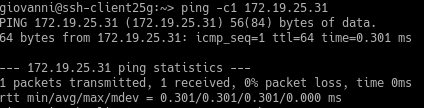

Luego de ello vamos a comprobar los puertos que tenemos abiertos en nuestro servidor. Para ello lanzamos el siguiente comando:
```bash
$> nmap -Pn ssh-server25g
```
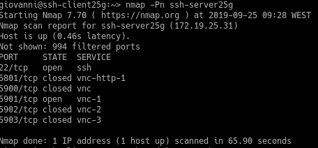

Finalmente probaremos a conectarnos al servidor a través del siguiente comando:
```bash
$> ssh rodriguez1@ssh-server25g
```
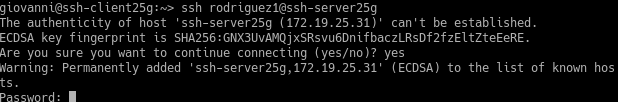

Terminaremos la conexión y comprobaremos el fichero **.ssh/known_hosts** y dentro de dicho fichero y saldrá la clave que habremos usado anteriormente en la conexión.

## 3.2 Comprobamos
Regeneramos las claves para el SSH y volveremos a conectarnos desde los clientes usando los usuarios **rodriguez2** y **rodriguez1**, primero comprobaremos con OpenSUSE y luego con Windows.

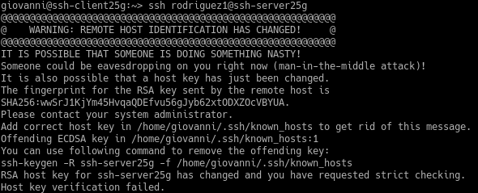

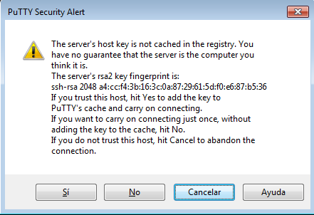

## 5. Autenticación mediante claves públicas
Vamos a la máquina **ssh-client25g**, iniciamos sesión con nuestro usuario **giovanni** y generemos un par de claves, las generaremos en:
* `/home/giovanni/.ssh/id_rsa`
* `/home/giovanni/.ssh/id_rsa.pub`

Usaremos el comando:

```bash
$> ssh-keygen -t rsa
```

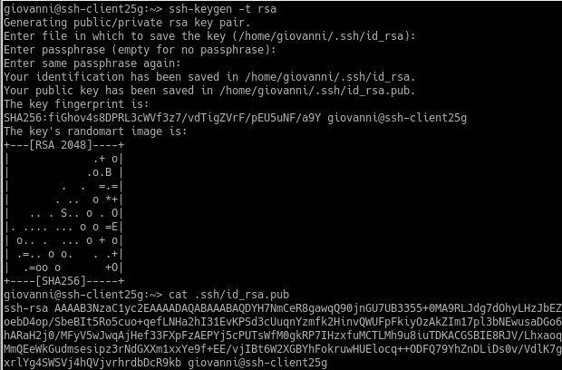

## 6. Uso de SSH como túnel para X
Instalaremos en nuestro servior una aplicación de entorno gráfico que no esté en los clientes, en la actividad usaremos **Geany**. Tendremos que modificar el fichero `/etc/ssh/sshd_config` y pondremos la opción `X11Forwarding` la pondremos en `yes`.

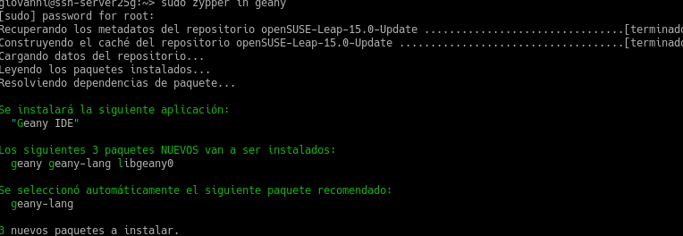

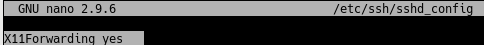

En el cliente lanzaremos el comando `ssh -X rodriguez1@ssh-server25g` para conectarnos y poder ejecutar la app de forma remota.

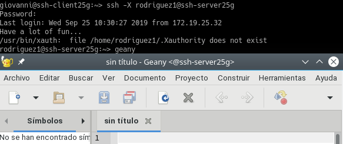

## 8.1 Restricción sobre un usuario
Vamos a bloquear la conectividad al usuario **rodriguez2**, para ello modificaremos el fichero `/etc/ssh/sshd_config` en el servidor. Tendremos que añadir una línea nueva con `DenyUsers` y ahí poner los usuarios que no queramos que se conecten por SSH.

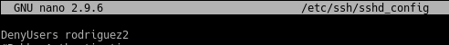

Ahora intentaremos entrar con el usuario al que le hemos bloqueado el acceso y comprobaremos que no puede acceder.

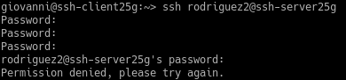
