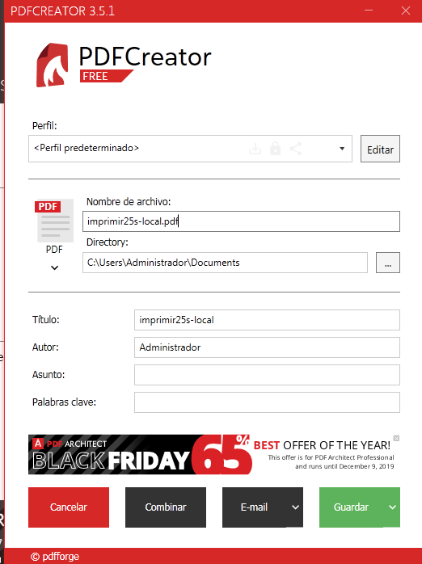
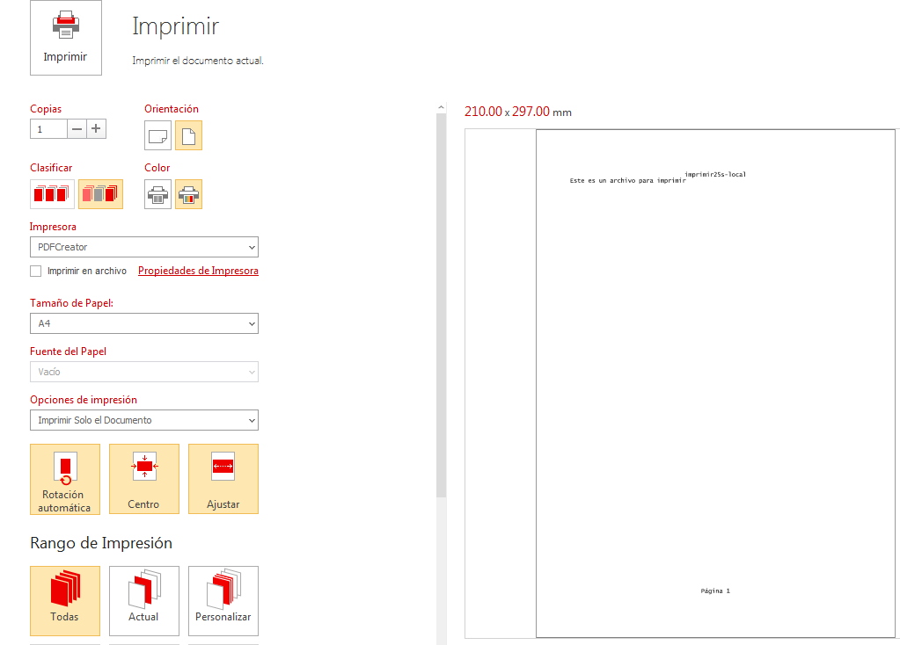
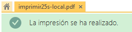
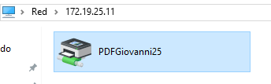
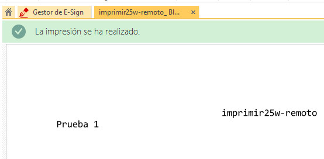
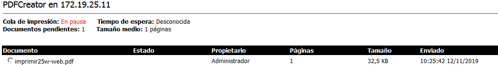
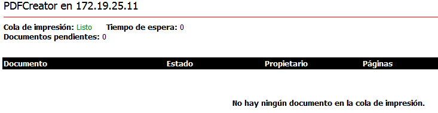

# A1 - Servidor de Impresión en Windows

## 1.3. Comprobar que se imprime de forma local

Crearemos un fichero con extensión **txt** que convertiremos a **pdf** en el programa instalado (PDFCreator).

Una vez tengamos el fichero vamos al programa, seleccionamos el fichero y le damos un nombre al PDF.

Hecho lo anterior ya podemos imprimirlo, seleccionamos de impresora **PDFCreator** y nos saldrá la vista previa del archivo a la derecha.

Al finalizar la impresión nos saldrá el siguiente mensaje:

## 2.2. Comprobar que se imprime de forma remota

Ahora desde una máquina cliente (en este caso la de nuestro compañero), conectará la impresora en red que hemos configurado en nuestro servidor para que pueda imprimir de forma remota.

A la hora de él imprimir hará lo mismo que nosotros en el paso anterior lo único que seleccionará nuestra impresora en red (anteriormente conectada).

## 3.3. Comprobar que se imprime desde el navegador

Ahora nuestro compañero hará lo mismo, pero nosotros pausaremos la impresión, lo cual hará que se quede en la cola de impresión

Luego de esto la reanudaremos para que el fichero se imprima, vemos que se ha reanudado y que ya no hay ningún fichero en la cola de impresión.

