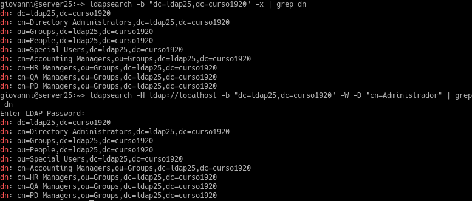
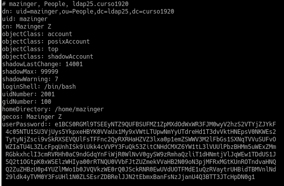
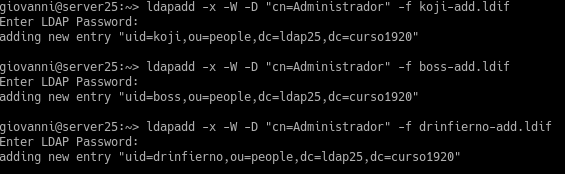
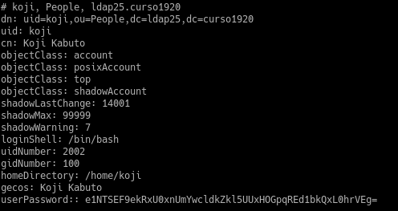
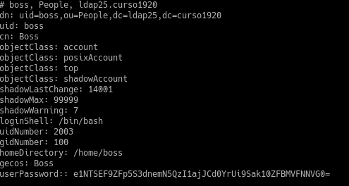
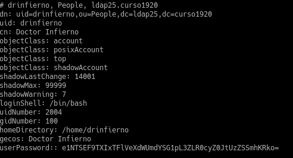

# A1 - Servidor 389-DS - OpenSUSE

## 2.3. Comprobar contenido del DS LDAP

Anteriormente hemos configurado LDAP para su uso, aquí vemos el contenido de nuestra base de datos LDAP.

## 3.3. Comprobar nuevo usuario

Ahora hemos añadido al usuario "Mazinger" a nuestro servidor LDAP, pero con clave en claro.

## 4.3. Comprobar los usuarios creado

Ahora hemos añadido los usuarios "Koji", "Boss" y "Dr.Infierno", ahora con claves encriptadas.

Ahora comprobamos desde el cliente.

Usuario "Koji".

Usuario "Boss".

Usuario "Dr.Infierno".

