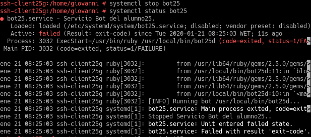
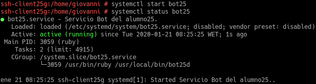
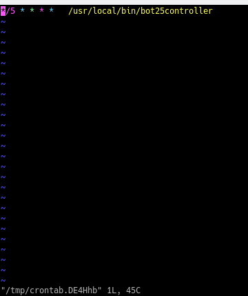
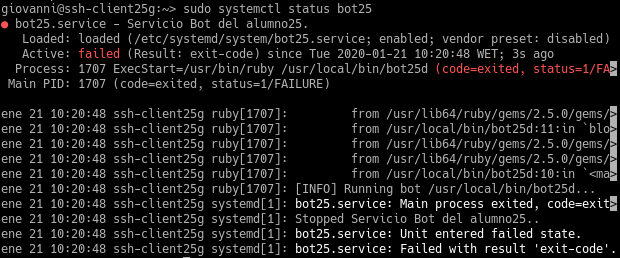
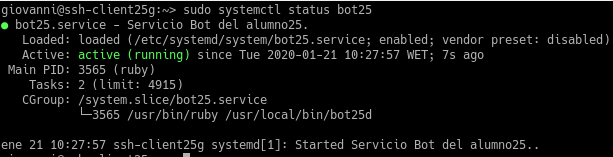

# Servicio de comunicaciones con Telegram

| ID  | Criterio |
| --- | -------- |
| 1.4 | Entrega  |
| 2.4 | Entrega  |
| 3.2 | Tareas programadas |

## 1.4 Entrega
Script utilizado:

```ruby
#!/usr/bin/env ruby

require 'telegram/bot'

token = `cat /etc/bot25/token`.strip
bot_username = '@Giovanni25_bot'

puts "[INFO] Running bot #{$0}..."

Telegram::Bot::Client.run(token) do |bot|
  bot.listen do |message|
    puts " => #{message.text}"
    if message.text == "/hola"
      bot.api.send_message(chat_id: message.chat.id, text: "Oooh, ¡que pasó!")
    elsif message.text == "/adios"
      bot.api.send_message(chat_id: message.chat.id, text: "Engaa, ¡nos vemos!")
    elsif message.text == "/ip"
      ip = `ip a | grep inet | grep eth1`.split
      bot.api.send_message(chat_id: message.chat.id, text: "Tiene asignada la IP: #{ip[1]}")
    elsif message.text == "/ping"
      ms = `ping 8.8.4.4 -c1`
      bot.api.send_message(chat_id: message.chat.id, text: ms)
    elsif message.text == "/apache"
      estados = `systemctl status apache2 | grep Active`.split
      bot.api.send_message(chat_id: message.chat.id, text: "El estado de Apache es: #{estados[1]}")
    elsif message.text == "/apacheon"
      estados = `systemctl status apache2 | grep Active`.split
      bot.api.send_message(chat_id: message.chat.id, text: "El estado de Apache es: #{estados[1]}")
    end
  end
end
```

**URL del vídeo en YouTube:** https://youtu.be/MWAbXlgehjs

## 2.4 Entrega
Fichero de configuración para que se inicie el servicio cada vez que iniciamos el equipo:
```bash
[Unit]
Description=Servicio Bot del alumno25.
After=network.service

[Service]
Type=simple
ExecStart=/usr/bin/ruby /usr/local/bin/bot25d

[Install]
WantedBy=multi-user.target
```

Aquí paramos el servicio y vemos su estado.


Lo volvemos a arrancar y volvemos a ver su estado.


## 3.2 Tareas programadas
Aquí vemos el fichero de configuración para que el script se ejecute cada 5 minutos.


Paramos el servicio.


Pasados 5 minutos vemos que el servicio arrancó automáticamente.

