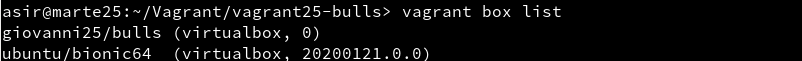

# Vagrant con VirtualBox

| Sección               |
| --------------------- |
| 3.3 Comprobar proyecto 1    |
| 5.2 Comprobar proyecto 2    |
| 6.1 Suministro Shell Script |
| 6.2 Suministro Puppet       |
| 7.2 Crear Box Vagrant       |

## 3.3 Comprobar proyecto 1
Dentro de "vagrant/proyecto1" lanzamos **vagrant up** y este es el resultado:
```
asir@marte25:~/Vagrant/vagrant25-proyecto1> vagrant up
Bringing machine 'default' up with 'virtualbox' provider...
==> default: Importing base box 'ubuntu/bionic64'...
==> default: Matching MAC address for NAT networking...
==> default: Checking if box 'ubuntu/bionic64' version '20200121.0.0' is up to date...
==> default: Setting the name of the VM: vagrant25-proyecto1_default_1579689035091_70039
==> default: Clearing any previously set network interfaces...
==> default: Preparing network interfaces based on configuration...
    default: Adapter 1: nat
==> default: Forwarding ports...
    default: 22 (guest) => 2222 (host) (adapter 1)
==> default: Running 'pre-boot' VM customizations...
==> default: Booting VM...
==> default: Waiting for machine to boot. This may take a few minutes...
    default: SSH address: 127.0.0.1:2222
    default: SSH username: vagrant
    default: SSH auth method: private key
    default: Warning: Connection reset. Retrying...
    default: Warning: Remote connection disconnect. Retrying...
    default:
    default: Vagrant insecure key detected. Vagrant will automatically replace
    default: this with a newly generated keypair for better security.
    default:
    default: Inserting generated public key within guest...
    default: Removing insecure key from the guest if it's present...
    default: Key inserted! Disconnecting and reconnecting using new SSH key...
==> default: Machine booted and ready!
==> default: Checking for guest additions in VM...
    default: The guest additions on this VM do not match the installed version of
    default: VirtualBox! In most cases this is fine, but in rare cases it can
    default: prevent things such as shared folders from working properly. If you see
    default: shared folder errors, please make sure the guest additions within the
    default: virtual machine match the version of VirtualBox you have installed on
    default: your host and reload your VM.
    default:
    default: Guest Additions Version: 5.2.34
    default: VirtualBox Version: 6.0
==> default: Mounting shared folders...
    default: /vagrant => /home/asir/Vagrant/vagrant25-proyecto1
```

Luego de esto lanzamos **vagrant ssh** para conectarnos a la máquina.


## 5.2 Comprobar proyecto 2
Crearemos "vagrant/proyecto2" y configuraremos todo como en el punto anterior añadiendo la siguiente línea adicional al fichero.
```bash
config.vm.network :forwarded_port, host: 4567, guest: 80
```

Aquí vemos los puertos configurados.


Aquí vemos que accediendo en un navegador con **127.0.0.1:4567** nos carga la página correctamente.


## 6.1 Suministro Shell Script
Crearemos "vagrant/proyecto3" y configuraremos todo como en los pasos anteriores añadiendo la siguiente línea:
```bash
config.vm.provision :shell, :path => "install_apache.sh"
```

Creamos el siguiente script y le damos permisos de ejecución:
```bash
#!/usr/bin/env bash

apt-get update
apt-get install -y apache2
rm -rf /var/www
ln -fs /vagrant /var/www
echo "<h1>Vagrant Proyecto 3</h1>" > /var/www/index.html
echo "<p>Curso201920</p>" >> /var/www/index.html
echo "<p>Giovanni</p>" >> /var/www/index.html
```
Accedemos como en el apartado anterior a **127.0.0.1:4567** y nos debería cargar la página correctamente con:


## 6.2 Suministro Puppet
Crearemos "vagrant/proyecto3" y configuraremos todo como en los pasos anteriores añadiendo la siguientes líneas:
```bash
Vagrant.configure(2) do |config|
  ...
  config.vm.provision "puppet" do |puppet|
    puppet.manifest_file = "default.pp"
  end
 end
```


Ahora creamos la carpeta "manifests" y dentro de ella el fichero "default.pp" con lo siguiente:


Nos saldrá el siguiente error, para solucionarlo haremos los siguientes pasos:


Entramos a la máquina usando "vagrant ssh" y instalaremos "puppet" en ella.


Luego lanzamos "vagrant reload".


Y cuando este acabe "vagrant provision", luego de esto el error estará solucionado.


## 7.2 Crear Box Vagrant
Crearemos "vagrant/bulls".

Lanzamos "VBoxManage list vms" para ver el nombre de todas nuestras máquinas, y crearemos la caja a partir de la máquina virtualm que nosotros queramos, en este caso usaremos la de "OpenSUSE".


Ahora crearemos la caja a partir de la máquina virtual.


Comprobamos que se ha creado correctamente.


Por último añadimos la caja al repositorio local de cajas de nuestra máquina.


Comprobamos que se ha añadido correctamente.


