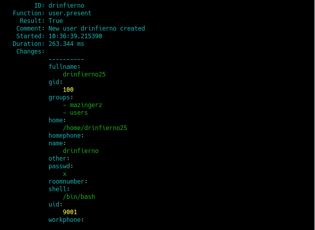

# **UT6-A2: Salt-Stack**

## 1. Preparativos
| Config   | MV1           | MV2          |
| -------- | ------------- | ------------ |
| Alias    | Master        | Minion       |
| Hostname | master25g     | minion25g    |
| SO       | OpenSUSE      | OpenSUSE     |
| IP       | 172.19.25.31  | 172.19.25.32 |

## 2. Master: instalar y configurar
Vamos a la máquina 1 y lanzamos **"zypper install salt-master"** para instalar la herramienta de "servidor".

Modificamos **/etc/salt/master** para configurar nuestro Master.

Ahora **activamos** el servicio en el arranque del sistema y lo **iniciamos**.

 Por último **comprobamos** los "Minions" aceptados, vemos que no tenemos ninguno todavía.

## 3. Minion

### 3.1 Instalación y configuración
Ahora en la máquina 2 lanzamos **"zypper install salt-minion"** para instalar la herramienta de "cliente".

Vamos a **/etc/salt/minion** y configuramos el Master.

Ahora **activamos** el servicio en el arranque y lo **activamos** como hicimos en el servidor.

Comprobamos que no tenemos el servicio apache2 instalado.

### 3.2 Aceptación desde el Master
Volvemos a la máquina 1 y lanzamos "salt-key -L" y vemos que tenemos la petición del Minion.

Aceptamos la petición y lo comprobammos.

### 3.3 Comprobamos conectividad
Ahora desde el master lanzamos los siguientes comandos para las comprobaciones.

## 4. Salt States
### 4.1 Preparar el directorio para los estados
Creamos los directorios **/srv/salt/base** y **/srv/salt/devel**.

Y creamos el fichero **roots.conf** en **/etc/salt/master.d**.

Reiniciamos el servicio.

### 4.2 Crear un nuevo estado
Ahora creamos el fichero **init.sls** en la ruta **/srv/salt/base/apache** y añadimos lo siguiente.

### 4.3 Asociar Minions a estados
Creamos el fuchero **top.sls** en **/srv/salt/base** y definimos lo siguiente:

### 4.4 Comprobar estados definidos
Ahora lanzamos lo siguiente para consultar los estados:

### 4.5 Aplicar nuevo estado
Ahora lanzamos los dos siguientes comandos para ver que no hay errores en las definiciones:

Por último aplicamos el estado.

## 5. Crear más estados
### 5.1 Crear estado "users"
Creamos el directorio **/srv/aslt//base/users** y dentro el fichero **init.sls**.

Y aplicamos el estado.

### 5.2 Crear estado "directories"
Creamos el directorio **/srv/aslt//base/directories** y dentro el fichero **init.sls**.

Aplicamos el estado.

## 6. Añadir Minion de otro SO
Ahora vamos a una máquina 3 con SO Windows.

En la instalación nos pedirá la IP del Master y el hostname del Minion.

Por último vamos al Master y aceptamos al Minion.

