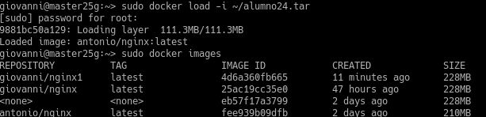
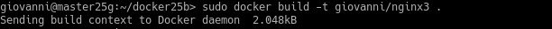

# **UT6-A3: Contenedores con Docker**

## 1. Habilitar el acceso a la red externa a los contenedores
Vamos a "YaST" > "Ajustes de red" > "Encaminamiento" y habilitamos el reenvío de Ipv4.

## 2. Instalación y primeras pruebas
### 2.1 Instalación
Abrimos una terminal y lanzamos "zypper in docker".

Ahora iniciamos el servicio y vemos su versión.

## 2. Creación manual
### 2.1 Crear una imagen manualmente
Vemos las imágenes que tenemos, en este caso todavía no tenemos ninguna.

Buscamos en los repositorios con la etiqueta "debian".

Nos descargamos la imagen "debian9".

Vemos todos los contenedores.

Ahora vemos solo los que están en ejecución.

Creamoso un contenedor que se llame **con_debian** a partir de la imagen que acabamos de descargar y ejecutamos **/bin/bash**.

### 2.2 Personalizar el contenedor
Comprobamos que estamos en debian.

Actualizamos los repositorios.

Instalamos Nginx.

Instalamos el editor Vi.

Iniciamos el servicio Nginx.

Lanzamos "ps -ef", vemos que no existe, lo intentamos instalar, pero no existe el paquete.

Creamos el fichero **holamundo.html** con nuestro nombre.

Creamos el siguiente script:

### 2.3 Crear una imagen a partir del contenedor
Ahora vamos a crear una nueva imagen, para ello tenemos que saber la ID del contenedor que ya tenemos, hacemos lo siguiente:

Ahora paramos el contenedor "con_debian", vemos que se ha parado y lo eliminamos.

## 3. Crear contenedor a partir de nuestra imagen
### 3.1 Crear contenedor con Nginx
Ahora creamos el contenedor con Ngnix instalado.

### 3.2 Comprobamos
Vemos todos los contenedores.

Vemos que inicia la máquina

Abrimos un navegador y vemos que funciona la página por defecto de Nginx.

Ahora vamos a visualizar el fichero html añadiendo lo siguiente:

### 3.3 Migrar la imágen a otra máquina
Ahora guardamos la imagen con nuestro nombre y se la pasamos a un compañero.

Ahora importamos la imagen de nuestro compañero.

## 4. Dockerfile
### 4.1 Preparar ficheros
Creamos el directorio **docker25a** en nuestro home con los ficheros **holamundo.html** y **server.sh** creados anteriormente.

Ahora creamos el fichero **Dockerfile** con lo siguiente:

### 4.2 Crear imagen a partir del Dockerfile
Ahora lanzamos lo siguiente:

Comprobamos que está nuestra imagen.

### 4.3 Crear contenedor y comprobar
Ahora crearemos el contenedor con la imagen anterior.

Ahora abrimos un navegador y probamos.

Y comprobamos el fichero **holamundo.html**.

### 4.4 Usar imágenes ya creadas
Creamos el directorio **docker25b** y dentro creamos el fichero **Dockerfile** con lo siguiente:

Creamos la imagen.

Creamos el contenedor.

Comprobamos en un navegador.

## 5. Limpiar contenedores e imágenes
Ahora borramos todos los contenedores.

Y hacemos lo mismo con las imágenes.

